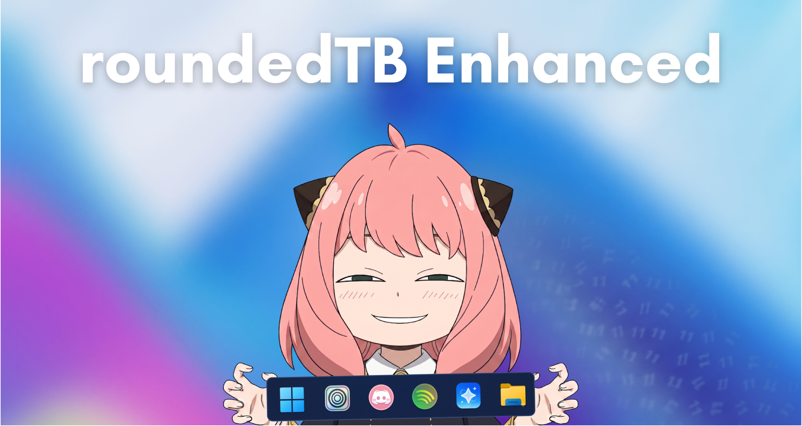

# 🚀 RoundedTB Enhanced Edition! ✨

Yo! Welcome to **RoundedTB Enhanced**! 🌟

If you want to make your Windows taskbar look absolutely cracked, you've come to the right place. 💻🔥 This is a modernized, custom fork of the original RoundedTB project, specifically upgraded to run flawlessly on the latest Windows builds without breaking a sweat!

---

## ⚡ What's the Vibe? (Features)

* **🎨 Sleek Vertical UI:** Ditched the old clunky horizontal tabs. Now featuring a premium, vertical card layout wrapper that fits like a glove!
* **🖼️ Edge-to-Edge Banner:** A beautiful header banner that fits the window perfectly with zero annoying gaps.
* **💪 Taskbar Full Auto-Restore:** The taskbar automatically expands back to full width if icons fill up the bar and get too close to the system tray, keeping your desktop clean and functional.
* **💧 TranslucentTB Compatibility:** Full compatibility out of the box with TranslucentTB so you can get that gorgeous transparent, rounded vibe. 🤝

---

## 🚀 Quick Start (Zero Setup!)

We made this easy. You don't need to install .NET or deal with a massive folder full of DLLs!

1. Go to the root directory of this project.
2. Grab [standalone.exe](standalone.exe).
3. Double-click it.
4. Customize your corner radius and margins.
5. Hit **Apply** and watch your taskbar transform instantly! 🌟

---

## 🛠️ Developer Stuff (If you want to tweak it)

* Open the [RoundedTB](RoundedTB/) folder to modify the C# source code.
* Rebuild using the local `.dotnet` SDK toolchain anytime.

Stay sleek! ✌️
